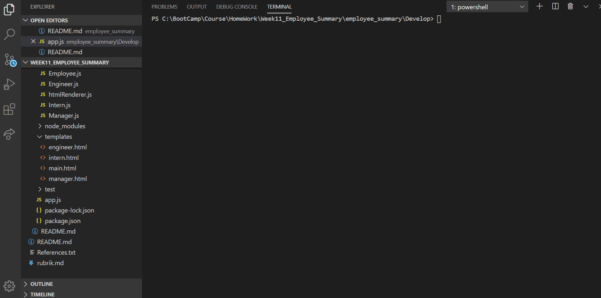

# Project Title: Employee Summary

# Email Address

luta_atul@hotmail.com

Table of Contents:

[Description](#Description:)

[Installation](#Installation:)

[Usage](#Usage:)

[Licence](#Licence:)

[Contributing](#Contributing:)

[Screenshots](#Screenshots:)

[References](#References:)

# Description:

This project is about creating Employee Summary. It is built using Node CLI that takes in information about employees and generates an HTML webpage that displays summaries for each person. Employee can be added as a Manager, Engineer or Intern. The project generates a `team.html` page in the `output` directory, that displays a nicely formatted team roster.

# Installation:

Navigate to following folder

https://github.com/atulsd/employee_summary

Clone the Repo

To view the web pages go to the following link

https://atulsd.github.io/employee_summary/

# Contributing

This is an open source project and is avaiable for anyone with a reference to it.

# Usage

This project creates employee summary. Employee can be added as a Manager, Engineer or Intern. The project promptx the user to build an engineering team.

# Licence

# Screenshots

# References:

Regular Expression: https://www.w3schools.com/jsref/jsref_obj_regexp.asp

https://stackoverflow.com/questions/54677910/international-telephone-input-regexp-placeholder-issues

https://www.npmjs.com/package/ansi-styles

Create a directroy if it does not exist in node: https://stackoverflow.com/questions/21194934/how-to-create-a-directory-if-it-doesnt-exist-using-node-js

Inquirer Package: https://www.npmjs.com/package/inquirer
